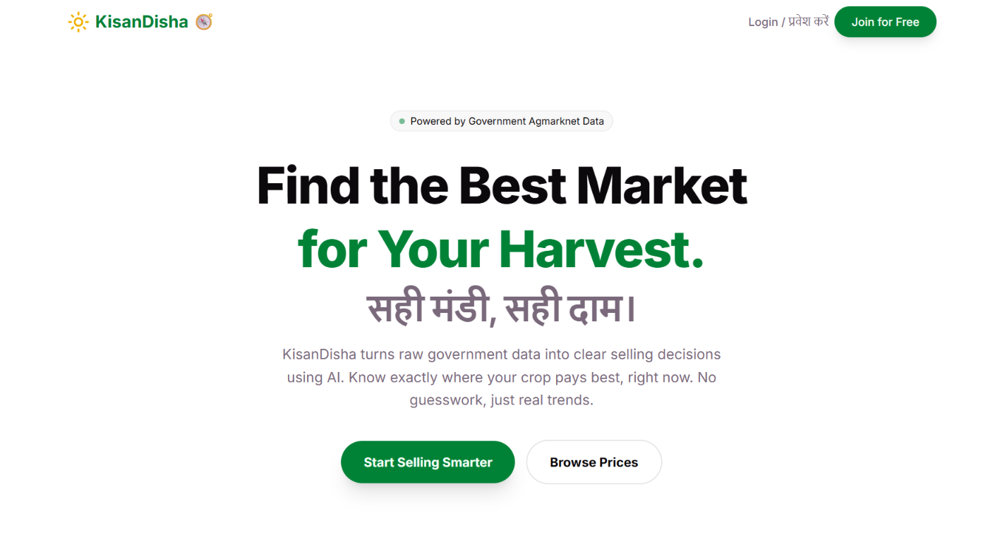
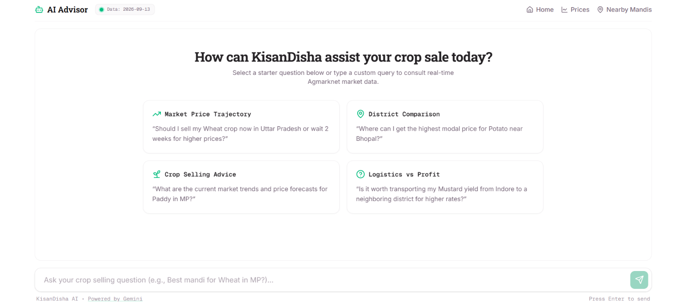
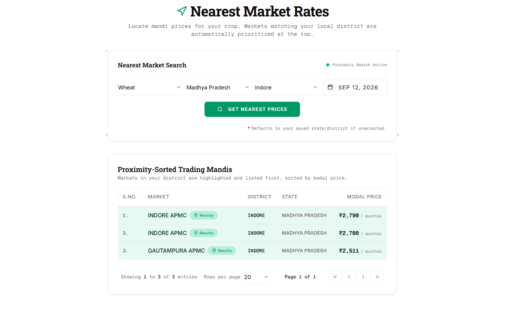
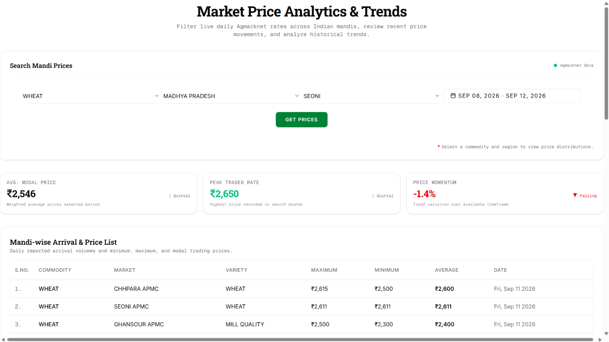
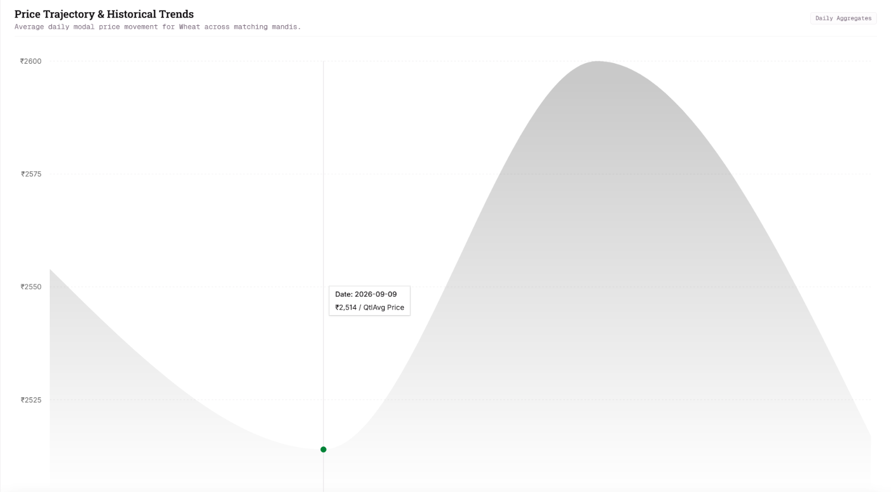

# [KisanDisha 🧭](https://kisandisha.vercel.app)

<p align="center">
  <strong>AI-powered market intelligence for Indian farmers - real government mandi data, grounded price comparisons, and a tool-calling AI advisor that recommends where to sell.</strong>
</p>

<p align="center">
  <a href="https://kisandisha.vercel.app">🌐 Live Demo</a> •
  <a href="https://github.com/vaidikdubey/KisanDisha">📂 Repository</a>
</p>

---

## 📖 Overview

Indian farmers have no easy way to compare what a crop is worth across nearby markets on a given day - the government publishes this data publicly (data.gov.in / Agmarknet), but it's raw and unusable in the field. KisanDisha turns it into a direct answer: live price comparison, a nearest-markets ranking, and an AI advisor you can ask in plain language.

## 📸 Screenshots

| Landing | AI Advisor | Nearest Markets |
|---|---|---|
|  |  |  |

| Prices | Price Trends |
|---|---|
|  |  |

## ✨ Features

**Auth** - email/password and Google OAuth, with a dedicated onboarding flow (state, district, crop preferences, mobile number) for new users regardless of signup method, forgot/reset password included.

**Price Comparison** (`/prices`) - filter by commodity, state, district, and date range; paginated results table with min/max/modal price per market, plus a price trend graph along with table row based toggle to view trends for a specific market.

**Nearest Markets** (`/nearby`) - for a chosen commodity and location, ranks markets by district-then-state proximity and modal price, so the highest-value nearby option surfaces first.

**AI Selling Advisor** (`/chat`) - ask a real question ("500kg tomatoes near Bhopal, where should I sell?") and get a grounded recommendation. Built on Gemini's tool-calling: the agent calls structured functions (`get_prices`, `get_price_trends`, `get_nearest_market`, `get_available_commodities`, `get_available_locations`, `get_data_freshness`) against live Postgres data rather than answering from general knowledge - every response is traceable to real data, not hallucinated. Handles ambiguous questions, missing data, and out-of-scope requests gracefully, with a system prompt that keeps it focused on crop-selling decisions and redirects to other app pages when relevant.

## 🛠️ Tech Stack

- **Frontend/API**: Next.js, TypeScript, Tailwind CSS, shadcn/ui
- **Database**: PostgreSQL (Supabase, transaction pooler), Prisma ORM with the driver-adapter pattern (`@prisma/adapter-pg`)
- **Cache & rate limiting**: Upstash Redis
- **Scheduled ingestion**: AWS Lambda + EventBridge, running twice daily
- **AI**: Google Gemini API, function/tool-calling
- **Testing**: Vitest, against an isolated Docker Postgres instance
- **Deployment**: Vercel

## ⚙️ Reliability & Engineering Highlights

- **Idempotent ingestion** - daily price data ingested via a scheduled Lambda function with retry/backoff against real API rate limits, and idempotent upserts (unique constraint on commodity + market + date + variety) so a retried or duplicate run never creates duplicate records - proven by an automated test, not just claimed.
- **Automated test suite** (Vitest) - 5 tests covering idempotency, retry/backoff behavior under simulated API failure, an end-to-end happy path (ingestion → query), and an end-to-end failure-recovery path (a fully failed run followed by a successful one, verified to leave the database in a correct final state).
- **Caching, with measured impact** - cache-aside pattern (Redis) on all read-heavy endpoints. Real measured results:

  | Endpoint | Cache miss | Cache hit |
  |---|---|---|
  | /commodities | 444ms | 0.72ms |
  | /locations | 295ms | 0.88ms |
  | /freshness | 574ms | 0.62ms |
  | /prices | 316ms | 0.61ms |
  | /trends | 95ms | 0.50ms |
  | /nearby | 656ms | 0.40ms |

- **Rate limiting** - sliding-window limits (Upstash Ratelimit) on the AI advisor endpoint specifically protect a finite daily LLM quota from being exhausted by burst traffic, with a looser limit on read-only endpoints as general anti-abuse.
- **Resilient by design, not just in theory** - the twice-daily ingestion schedule means a single failed run (network timeout, API downtime) self-heals on the next scheduled run without manual intervention, verified in production during actual development.

## 🚀 Getting Started

```bash
git clone https://github.com/vaidikdubey/KisanDisha.git
cd KisanDisha
npm install
cp .env.example .env
# Required: DATABASE_URL, GEMINI_API_KEY, LGD_GOV_API_KEY (data.gov.in),
# UPSTASH_REDIS_REST_URL, UPSTASH_REDIS_REST_TOKEN,
# GOOGLE_OAUTH_CLIENT_ID, GOOGLE_OAUTH_CLIENT_SECRET,
# NEXTAUTH_SECRET, RESEND_API_KEY
npx prisma generate
npx prisma db push
npm run dev
```

Run tests (spins up against a separate Docker Postgres instance - see `.env.test`):
```bash
npm run test
```

## 📂 Project Structure

```text
kisandisha/
├── src/
│   ├── app/                   # Next.js App Router pages & API routes
│   ├── lib/
│   │   ├── agent/             # AI advisor: tool declarations, system prompt, reasoning loop
│   │   ├── queries/           # Shared DB query functions (prices, nearest markets)
│   │   ├── ratelimit.ts
│   │   ├── cache.ts
│   │   ├── runIngestion.ts
│   │   └── prisma.ts
│   ├── generated/prisma/      # Generated Prisma client
│   └── proxy.ts               # Route protection, onboarding enforcement
├── lambda/handler.ts          # AWS Lambda entry point for scheduled ingestion
├── scripts/                   # Standalone runnable scripts (manual ingestion trigger, etc.)
├── prisma/schema.prisma
└── src/lib/tests/             # Vitest test suite
```

## 🔮 Roadmap

**V2**: true geocoded distance ranking, price alerts, broader crop/state coverage, trend forecasting, multi-user/cooperative accounts, a React Native mobile app.

**V3**: vendor directory and price comparison for farm inputs (seeds, fertilizer, pesticides), marketplace features, logistics coordination.

## 🤝 Contributing

Contributions welcome - fork, branch, commit, push, open a PR.

## 👨‍💻 Author

**Vaidik Dubey**

· GitHub: https://github.com/vaidikdubey 

· LinkedIn: https://www.linkedin.com/in/vaidik-dubey/

---

<p align="center">Built with ❤️ using Next.js, TypeScript, PostgreSQL, AWS Lambda, Redis, and Google Gemini AI.</p>